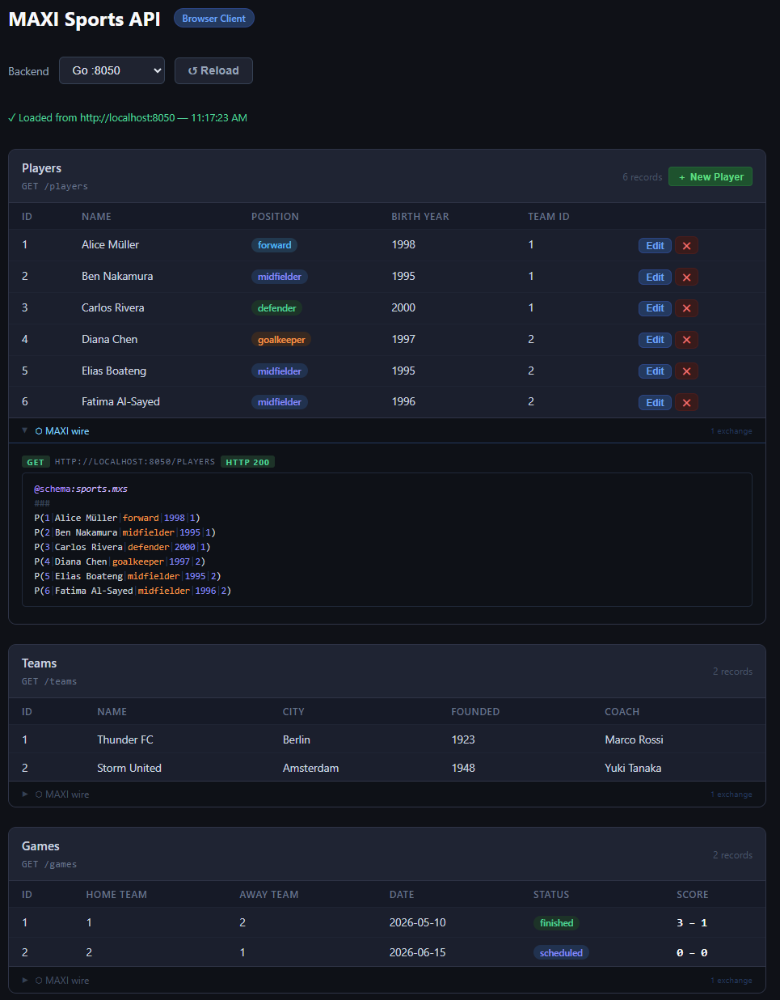

# MAXI Sports API — Cross-Language Example

Demonstrates **MAXI format** cross-language interoperability: multiple backend servers (Node.js,
Python, PHP, Go, Java) all speak the same `application/maxi` wire format. Any client can talk to any server
and get identical results.



## Services

| Service         | Port (host) | Stack              |
|-----------------|-------------|--------------------|
| `server-js`     | 8060        | Node.js / Express  |
| `server-py`     | 8070        | Python / Flask     |
| `server-php`    | 8080        | PHP built-in server |
| `server-go`     | 8050        | Go / net/http      |
| `server-java`   | 8040        | Java / Quarkus     |
| `client-browser`| 8090        | nginx (static SPA) |

## Quick Start — Docker Compose

```bash
cd maxi-examples
docker compose up --build
```

Then open the browser client at **http://localhost:8090** and use the **Backend** selector
to switch between the servers. The same data, the same MAXI wire format, five
different implementations.

All three servers share `./shared/data/*.json` as a Docker volume, so any player created
via POST on one server is visible to all others.

### Running the CLI clients in Docker

The CLI client containers are under the `clients` profile (one-shot, exit after completion):

```bash
# Start servers
docker compose up -d server-js server-py server-php server-go server-java
```

```bash
# Run each client against its default server
docker compose run --rm client-py          # Python client → Python server :8070
docker compose run --rm client-php         # PHP client    → PHP server :8080
docker compose run --rm client-js-cli      # JS client     → JS server :8060
docker compose run --rm client-go          # Go client     → Go server :8050
docker compose run --rm client-java        # Java client   → Java server :8040

# Cross-language: any client vs any server
docker compose run --rm -e BASE_URL=http://server-js:4000   client-php
docker compose run --rm -e BASE_URL=http://server-php:8080  client-py
docker compose run --rm -e BASE_URL=http://server-py:5000   client-js-cli

# Verbose mode — print every raw MAXI request/response body
docker compose run --rm -e VERBOSE=1 client-php
```

## Endpoints (same on all three servers)

| Method | Path                      | Description                               |
|--------|---------------------------|-------------------------------------------|
| GET    | `/players`                | All players                               |
| GET    | `/players/:id`            | Single player                             |
| POST   | `/players`                | Create player (body: `application/maxi`)  |
| PUT    | `/players/:id`            | Update player (body: `application/maxi`)  |
| GET    | `/players/:id/transfers`  | Transfer history (object references)      |
| GET    | `/teams`                  | All teams                                 |
| GET    | `/teams/:id`              | Team + roster                             |
| GET    | `/games`                  | All games                                 |
| GET    | `/games/:id`              | Game + detailed stats                     |
| GET    | `/transfers`              | All transfers (object references)         |
| GET    | `/schema/:name`           | Schema file (used by clients)             |

## Running Servers Individually (without Docker)

### Node.js

```bash
cd maxi-examples/server-js
npm install
node server.js                # http://localhost:8060
```

### Python

```bash
cd maxi-examples/server-py
pip install -r requirements.txt
python server.py              # http://localhost:8070
```

### PHP

```bash
cd maxi-examples/server-php
composer install
php -S 0.0.0.0:8080 server.php   # http://localhost:8080
```

## Running Clients

### JavaScript CLI Client

```bash
cd maxi-examples/client-js
npm install
BASE_URL=http://localhost:8060 node client.js   # JS server
BASE_URL=http://localhost:8070 node client.js   # Python server
BASE_URL=http://localhost:8080 node client.js   # PHP server
```

### Python CLI Client

```bash
cd maxi-examples/client-py
pip install -r requirements.txt
BASE_URL=http://localhost:8060 python client.py   # JS server
BASE_URL=http://localhost:8070 python client.py   # Python server
BASE_URL=http://localhost:8080 python client.py   # PHP server
```

### PHP CLI Client

```bash
cd maxi-examples/client-php
composer install
BASE_URL=http://localhost:8060 php client.php   # JS server
BASE_URL=http://localhost:8070 php client.php   # Python server
BASE_URL=http://localhost:8080 php client.php   # PHP server
```

## Cross-Language Interoperability Matrix

| Server \ Client | JS CLI | Python CLI | PHP CLI | Go CLI | Java CLI | Browser |
|-----------------|--------|------------|---------|--------|----------|---------|
| JS (8060)       | ✅     | ✅         | ✅      | ✅     | ✅       | ✅      |
| Python (8070)   | ✅     | ✅         | ✅      | ✅     | ✅       | ✅      |
| PHP (8080)      | ✅     | ✅         | ✅      | ✅     | ✅       | ✅      |
| Go (8050)       | ✅     | ✅         | ✅      | ✅     | ✅       | ✅      |
| Java (8040)     | ✅     | ✅         | ✅      | ✅     | ✅       | ✅      |
